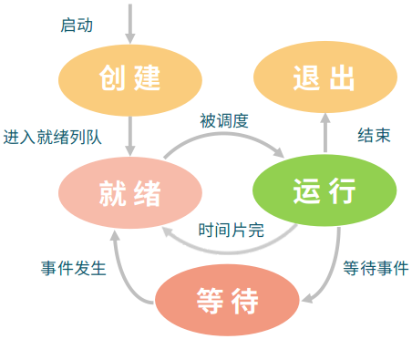
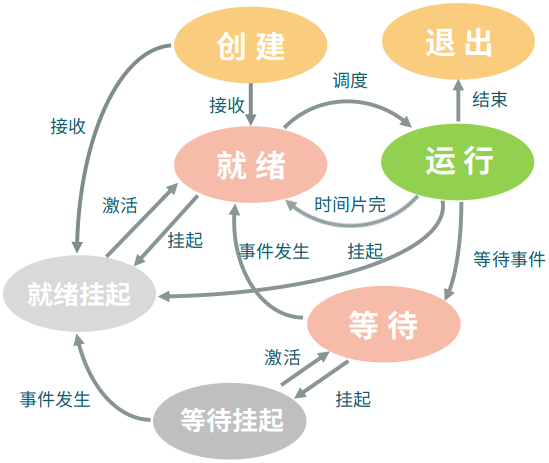
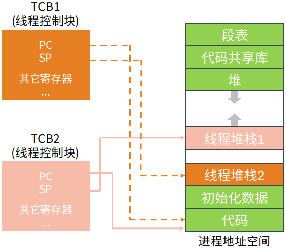
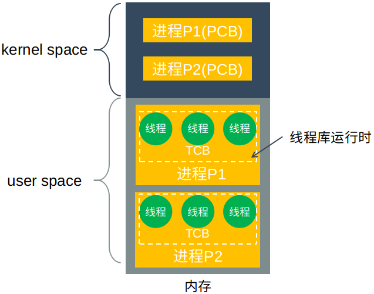
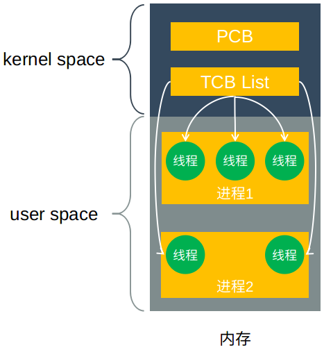

>本文是`操作系统系列`的第二篇文章，介绍操作系统中的核心概念进程和线程。[原文链接](https://mp.weixin.qq.com/s/R8GBEBYegXIK0DfxQYoI7Q)，更多内容见公号机器学习与系统，欢迎与我互动~
# 进程
## 概念
进程是一个`动态概念`，表示程序在一个数据集合上的一次动态执行过程。进程包含正在运行的一个程序的所有状态信息：
- 代码
- 数据
- 状态寄存器
- 通用寄存器
- 系统资源(文件、内存...)

进程可以动态创建和结束，多个进程可以并发执行，不同进程间互不影响(操作系统实现)。同时进程间又相互制约，它们因访问`共享数据/资源`或`进程间同步`而产生制约。

程序是静态的，它是文件。进程是动态的，是执行中的程序，进程=程序+执行状态。

## 进程控制块
`进程控制块(PCB, Process Control Block)`是操作系统用来管理进程运行的数据结构。每个进程都在操作系统中有一个对应的PCB，因此PCB是进程存在的唯一标志。

当进程创建时，生成PCB。进程终止时，操作系统会回收它的PCB。PCB的主要内容如下：
1. 调度和状态信息：调度进程和处理机使用情况 
2. 进程间通信信息：进程间通信相关的各种标识
3. 存储管理信息：指向进程映像存储空间数据结构
4. 进程所用资源：进程使用的系统资源，如打开文件等
5. 有关数据结构连接信息：与PCB相关的进程队列

操作系统中的PCB可以通过`链表`和`索引表`来组织。


链表结构中：
- 同一状态的进程其PCB组成同一链表，多个状态对应多个不同的链表
- 各状态的进程形成不同的链表：`就绪链表`、`阻塞链表`...

索引表结构中：
- 同一状态的进程归入一个索引表（由索引指向PCB），多个状态对应多个不同的索引表
- 各状态的进行形成不同的索引表：`就绪索引表`、`阻塞索引表`...

## 进程的状态
按照进程的生命周期，可以划分不同的状态(因操作系统而异)，常用的状态有：
- 创建：系统初始化、fork系统调用都会创建进程
- 就绪：进程获得除处理机外的所有资源
- 执行：内核选择就绪的进程，开始执行
- 等待：进程等待系统服务、等待IO结束、等待数据
- 抢占：高优先级进程先执行、进程当前时间片用完
- 唤醒：被阻塞进程需要的资源可被满足、被阻塞进程等待的事件到达
- 结束：
  - 正常退出(自愿)
  - 错误退出(自愿)
  - 致命错误(强制性)
  - 被其他进程所杀(强制性)

### 核心状态转换


1. NULL→创建：一个新进程被产生出来执行一个程序
2. 创建→就绪：当进程被创建完成并初始化后，一切就绪准备运行时，变为就绪状态
3. 就绪→运行：处于就绪状态的进程被进程调度程序选中后，就分配到处理机上来运行
4. 运行→结束：当进程表示它已经完成或者因出错，当前运行进程会由操作系统作结束处理
5. 运行→就绪：处于运行状态的进程在其运行过程中，由于分配给它的处理机时间片用完而让出处理机
6. 运行→等待：当进程请求某资源且必须等待时
7. 等待→就绪：当进程要等待某事件到来时，它从阻塞状态变到就绪状态

### 挂起
为了更好利用内存资源、减少进程占用内存，处在挂起状态的进程映像存储在磁盘上。此时进程的状态转换图更新如下：



1. 等待挂起状态(Blocked-suspend)：外存中处于等待状态的进程，等待某事件的出现
2. 就绪挂起状态(Ready-suspend)：进程在外存，但只要进入内存，即可运行
3. 挂起(Suspend)：把一个进程从内存转到外存
     - 等待->等待挂起：没有进程处于就绪状态或就绪进程需要更多内存
     - 就绪->就绪挂起：当有高优先级等待（系统认为会很快就绪的）进程和低优先级就绪进程
     - 运行->就绪挂起：对抢先式分时系统，当有高优先级等待挂起进程因事件出现而进入就绪挂起
4. 在外存时的状态转换
     - 等待挂起->就绪挂起：当有等待挂起进程因相关事件出现
5. 激活(Activate)：把一个进程从外存转到内存
     - 就绪挂起->就绪：没有就绪进程或挂起就绪进程优先级高于就绪进程
     - 等待挂起->等待：当一个进程释放足够内存，并有高优先级等待挂起进程

**上述的状态转换比较多，在理解时需要明白：挂起是为了解决内存资源，当进程状态->挂起时，应该从节约内存的角度思考**。

# 线程
## 为什么引入线程
程序执行的任务往往是复杂的，以MP3播放器为例，它需要执行3个核心任务：
1. 读取音频数据
2. 对数据进行解压缩
3. 播放解压缩的数据

```c
void main(void) {
  read();
  decompress();
  play();
}

read() {...}
decompress() {...}
play() {...}
```

单进程各个程序是`串行`的，影响资源的使用效率，即播放效果不好。但是如果改成多进程的话，系统开销变大，创建进程、进程结束、进程切换等需要更多的系统开销。

因此，提出一种新的解决方案：`在进程中增加一些实体，实体间可以并发执行并且共享相同的地址空间，这就是线程(thread)`。

## 概念


线程是进程的一部分，描述指令流执行状态，它是**进程中指令执行流的最小单元，是CPU调度的基本单位**。

**进程是资源分配维度的概念**：由一组相关资源构成，包括地址空间（代码段、数据段）、打开的文件等各种资源。

**线程是处理机调度维度的概念**：描述在进程资源环境中的指令流执行状态。

所以线程的粒度比进程要细一些。

线程 = 进程 - 共享资源
- 一个进程中可以同时存在多个线程
- 各个线程之间可以并发地执行
- 各个线程之间可以共享地址空间和文件等资源
- 一个线程崩溃，会导致其所属进程的所有线程崩溃

## 进程与线程比较


1. 进程是程序整体的资源分配单位，线程是CPU调度单位
2. 进程拥有一个完整的资源，线程只独享指令流执行的必要资源，如寄存器和栈
3. 线程状态少，只有就绪、等待和运行三种基本状态及状态间的转换关系
4. 线程能减少并发执行的时间和空间开销
     - 线程的创建和终止时间比进程短
     - 线程更轻量，同一进程内线程间切换时间比进程短
     - 由于同一进程的各线程间共享内存和文件资源，可不通过内核进行直接通信

## 用户/内核线程
线程的实现方式有：
1. 用户线程：运行在用户空间，由用户自己实现，如`POSIX Pthreads`、`Mach C-threads`和`Solaris threads`
2. 内核线程：运行在内核空间，在操作系统内核中实现，如`Windows`、`Solaris`和`Linux`
3. 轻量级进程：在内核中实现，支持用户线程，如`Solaris(LightWeight Process)`

### 用户线程


用户线程由一组`用户级的线程库函数来完成线程的管理`，包括线程的创建、终止、同步和调度等。

用户线程的特征：
1. 用户线程不依赖于操作系统的内核，内核不了解用户线程的存在
2. 在用户空间实现的线程机制，每个进程有私有的线程控制块(TCB)列表，由线程库函数维护
3. 同一进程内的用户线程切换速度快
4. 允许每个进程拥有自已的线程调度算法

用户线程的不足：
1. 线程发起系统调用而阻塞时，则整个进程进入等待
2. 不支持基于线程的处理机抢占，除非当前运行线程主动放弃，它所在进程的其他线程无法抢占CPU
3. 只能按进程分配CPU时间，多个线程进程中，每个线程的时间片较少

### 内核线程
由内核通过系统调用实现的线程机制，由内核完成线程的创建、终止和管理。



内核线程的特征：
1. 由内核维护PCB和TCB
2. 线程执行系统调用而被阻塞不影响其他线程
3. 线程的创建、终止和切换相对较大，通过系统调用/内核函数，在内核实现
4. 以线程为单位进行CPU时间分配，多线程的进程可获得更多CPU时间

### 用户/内核线程对应关系
1. 一对一：一个内核线程对应一个用户线程
2. 一对多：一个内核线程对应多个用户线程
3. 多对多：多个内核线程对应多个用户线程

## 总结
本文介绍了操作系统中的核心概念`进程`和`线程`。相比于“静态”的程序代码，它们是负责程序执行的“动态”概念。进程的粒度大，包含程序执行所需的完整资源；线程是CPU调度的单位，只包括指令执行的必要资源。

## References
- [清华大学-操作系统(2020春)](https://next.xuetangx.com/learn/THU08091000267/THU08091000267/1516699/video/1405127)